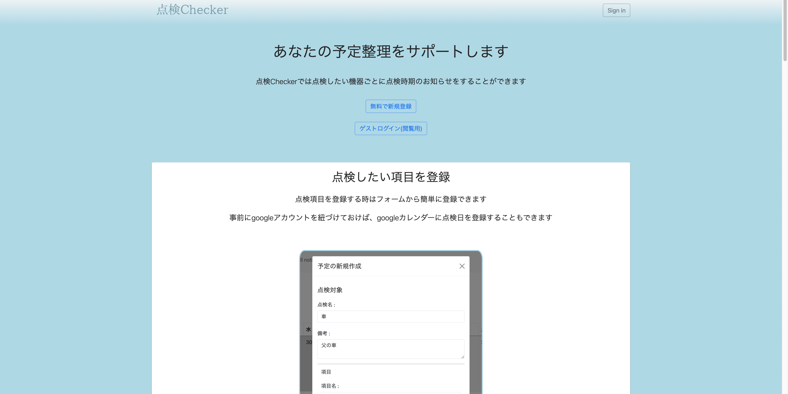
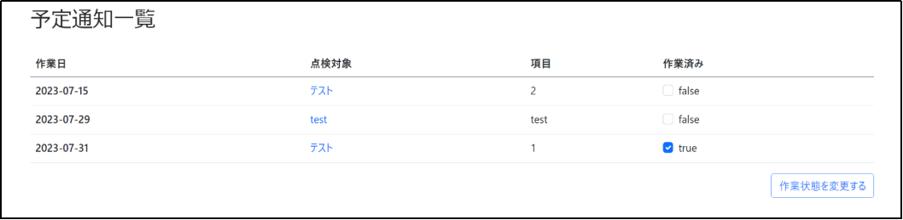
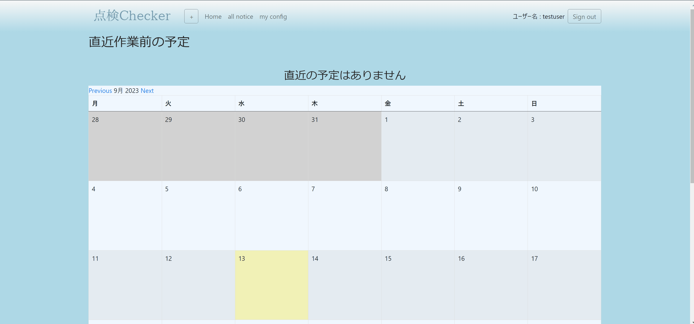
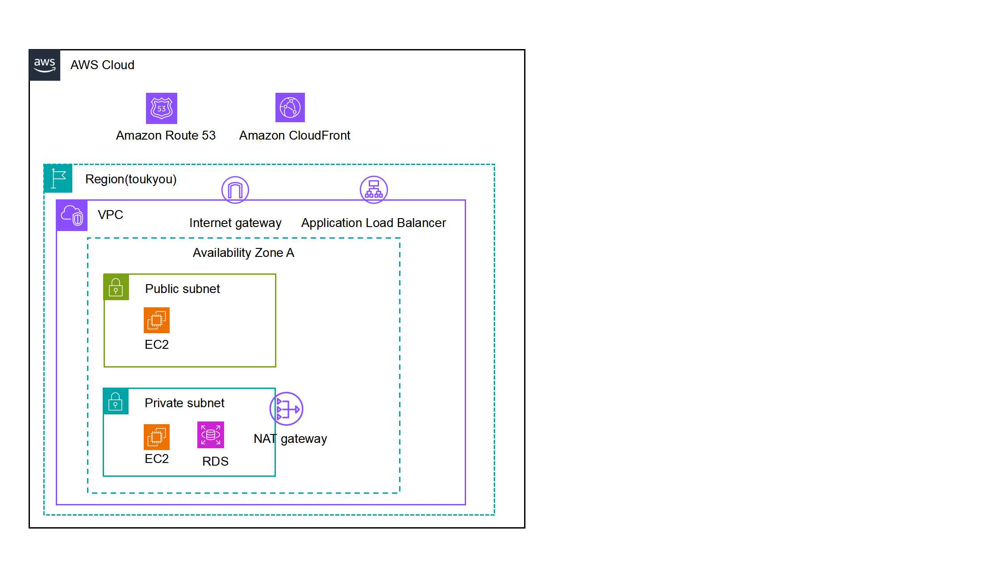

# ポートフォリオサイト　「点検チェッカー」

点検日を管理できるアプリケーションです．実施日と実施日のメール通知を機器ごと及びその機器の項目ごとに設定することができます．また，設定した点検日は一覧画面で実施，未実施の状態を確認できます．
レスポンシブにも対応している為スマートフォンからもご使用いただけます．

## 例
車を点検機器とした時，オイル交換，洗車の項目各々に実施日，実施通知日を設定することができます．また点検項目は自由に個数を増やすことができます．

予定は点検項目ごとに作業状況を管理することができます．

## googleアカウントとの連携
googleアカウントと連携することで、アカウントに紐づいたcalendarにイベントを登録することができます．

## 開発経緯
現職で使用している分析機器の点検の管理に使用したいと考えた為．医薬品開発で使用する分析器のメンテナンス管理は申請データにも係る為，実施漏れがずれないよう管理する必要があった．数多くある機器の管理を少しでも楽におこなえるようにしたく開発に着手しました．

## 開発概要
### 1.開発環境
実装環境  
* Ruby  2.5.3
* Ruby on Rails 6.1
* MySQL  8.0
* Nginx  
* Bootstrap  
* javascript  
* Github 
* docker,docker-compose  
  
使用Gem デバック用Gem  
* byebug
* rspec-rails
* factory_bot_rails
* pry-rails
* rails-erd
* rubocop
* rubocop-rails
* rubocop-airbnb'
* capybara
* letter_opener_web

### 2.AWSでのデプロイ実装
使用した機能  
* AWS VPC  
* AWS RDS  
* AWS EC2  
* AWS EC2(ALB)  
* AWS Route 53  

### 3.アプリケーションの機能一覧
* ユーザー登録，ログイン機能（device）
* 予定投稿機能(cocoon, jquery, Ajax)
* 予定の一覧，実施状態の一括変更機能(Form::ItemCollectionの作成)
* 予定の自動通知機能(whenever cron)
* 予定のcalendar表示機能(simple_calendar)
* googlecalendarとの連携及びgooglecalendarへの予定自動登録機能  
(google-api-client, google-apis-calendar_v3, googleauth)

### 4.テスト
#### Rspec
* 単体テスト(model, request)
* 統合テスト(system)  
capybara,factorybot使用
